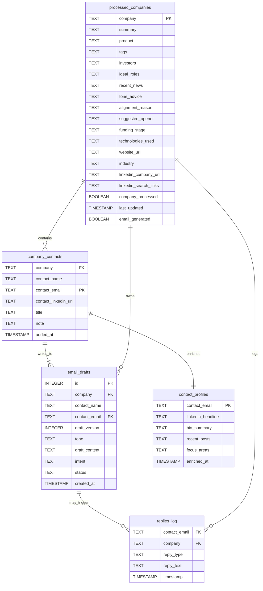

# Scout

Scout is a personal outreach intelligence system to help you:

- Discover aligned companies and people
- Enrich metadata from search, APIs, and AI
- Generate personalized cold email drafts with tracked intent
- Log outreach attempts, replies, and outcomes for reflection and improvement

> [Excel Input] --> [Enrichment] --> [Contacts] --> [Drafts] --> [Review/Send] --> [Logging]

## Table Of Contents

- [Scout](#scout)
  - [Table Of Contents](#table-of-contents)
  - [Config Files](#config-files)
  - [System Flow](#system-flow)
    - [Step 1: Project Setup](#step-1-project-setup)
    - [Step 2: Load \& Parse Excel](#step-2-load--parse-excel)
    - [Step 3: Metadata Enrichment Pipeline](#step-3-metadata-enrichment-pipeline)
      - [🎯 Trigger Condition](#-trigger-condition)
      - [📤 Input Data Required per Row](#-input-data-required-per-row)
      - [🔍 1: Perplexity API Queries](#-1-perplexity-api-queries)
      - [🧠 2: OpenAI Prompt — Company Intelligence Prompt](#-2-openai-prompt--company-intelligence-prompt)
      - [💾 3: Store Result in DuckDB](#-3-store-result-in-duckdb)
    - [Step 4: Contact Intelligence Metadata Generation](#step-4-contact-intelligence-metadata-generation)
      - [🔧 Prompt Template for Contact Info](#-prompt-template-for-contact-info)
      - [Final Schema: `company_contacts`](#final-schema-company_contacts)
      - [🧠 OpenAI Prompt (Contact Discovery)](#-openai-prompt-contact-discovery)
    - [Step 5: Email Draft Generation](#step-5-email-draft-generation)
      - [🧾 Prerequisites](#-prerequisites)
      - [🔍 1. Extract Context](#-1-extract-context)
        - [✅ From `processed_companies`](#-from-processed_companies)
        - [✅ From `company_contacts`](#-from-company_contacts)
        - [✅ From LinkedIn (if available)](#-from-linkedin-if-available)
      - [🔐 2. Add Your Static Info (You Control)](#-2-add-your-static-info-you-control)
      - [🧠 3. Prompt Template to OpenAI](#-3-prompt-template-to-openai)
      - [🪴 4. Call OpenAI → Parse Result](#-4-call-openai--parse-result)
      - [✅ 5: Insertion Function](#-5-insertion-function)
      - [💾 6. Insert Into `email_drafts` Table](#-6-insert-into-email_drafts-table)
      - [✅ 7: Determine Draft Version Programmatically](#-7-determine-draft-version-programmatically)
      - [🎯 Suggested `intent` Types (Enum Values)](#-suggested-intent-types-enum-values)
      - [💾 Draft Table Enhancement (Optional)](#-draft-table-enhancement-optional)
    - [Step 6: Manual Review Interface](#step-6-manual-review-interface)
    - [Step 7: Email Sending](#step-7-email-sending)
    - [Step 8: Logging \& Monitoring](#step-8-logging--monitoring)
  - [Schema And Relationships](#schema-and-relationships)
    - [Schema](#schema)
      - [`processed_companies`](#processed_companies)
      - [`company_contacts`](#company_contacts)
      - [`contact_profiles`](#contact_profiles)
      - [`email_drafts`](#email_drafts)
      - [`replies_log`](#replies_log)
      - [`api_errors_log`](#api_errors_log)
      - [`send_log`](#send_log)
    - [Table Relationship Diagram (Mermaid)](#table-relationship-diagram-mermaid)
  - [Data Structures](#data-structures)
  - [Suggestions](#suggestions)

## Config Files

- `you.json`: Stores personal info like GitHub, resume blurb, LinkedIn
- `prompts/`: Directory for templated messages (e.g. `intent_learning.j2`)
- `.env`: Contains API keys and optional base configuration

## System Flow

<details>
<summary>Project Setup</summary>

### Step 1: Project Setup

- Load .env for API keys, local paths
- Hardcode resume, GitHub, and LinkedIn URLs
- Configure logging (stdout + outreach.log)
- Create or connect to DuckDB file
- `prompts/` directory holds prompt templates (e.g. `intent_opportunity.j2`, `intent_learning.j2`)

</details>

<details>
<summary>Load & Parse Excel</summary>

### Step 2: Load & Parse Excel

- Get all rows from two specified sheets (Gmail integration) from a specified excel sheet page
  - These sheets are "Company Research" and "Processed Companies"
- The sheet "Company Research" will contain the following columns,
  ```tsv
  company   TEXT    Company name
  description   TEXT    Description of the company
  contact_info  TEXT    Contact for the company
  ```
- The sheet "Processed Companies" will contain the following columns,
    ```tsv
    company TEXT	Company name
    summary	TEXT	Cleaned 2-3 sentence summary
    product	TEXT	Primary products or services
    tags	TEXT	Comma-separated tags (e.g., "AI, Security, SaaS")
    investors	TEXT	Comma-separated investors (or JSON list if needed)
    ideal_roles	TEXT	Comma-separated target titles (e.g., "CTO, DevRel")
    recent_news	TEXT	One-line summary or JSON array of headlines
    tone_advice	TEXT	AI-generated advice (e.g., "technical and warm")
    alignment_reason	TEXT	Why this company is aligned with your interests
    suggested_opener	TEXT	Suggested first line for cold email
    linkedin_search_links	TEXT	Comma-separated or newline-separated LinkedIn search URLs
    company_processed	BOOLEAN	True if enrichment is complete
    last_updated	TIMESTAMP	Optional: helpful for debugging/sorting/filtering
    funding_stage	TEXT	E.g., Seed, Series A, Acquired - informs their hiring growth
    technologies_used	TEXT	Stack keywords (Go, AWS, etc.) scraped or AI-generated
    website_url	TEXT	For linking directly in outreach or scraping later
    industry	TEXT	Sector label, e.g., "Fintech", "MedTech"
    linkedin_company_url	TEXT	Auto-generated for quick company-level exploration
    email_generated	BOOLEAN	Whether at least one draft exists
    ```
- Sync rows -- insert or delete rows in the DuckDB files by checking the delta

</details>

<details>
<summary>Metadata Enrichment Pipeline</summary>

### Step 3: Metadata Enrichment Pipeline

#### 🎯 Trigger Condition

Loop through each row in your DuckDB `processed_companies` table where:

```sql
WHERE company_processed = FALSE
```

#### 📤 Input Data Required per Row

* `company`: name of the company
* (Optional: seed `description` if you have one manually or from LinkedIn)

---

#### 🔍 1: Perplexity API Queries

Perform 3-5 natural-language queries to Perplexity (or similar search/LLM wrapper).

| Query                                             | Purpose                                                   |
| ------------------------------------------------- | --------------------------------------------------------- |
| "What does \[Company] do?"                        | To get the core product/service and mission               |
| "What recent news is available about \[Company]?" | To populate `recent_news`                                 |
| "Who has invested in \[Company]?"                 | To get `investors`, `funding_stage`                       |
| "What technologies does \[Company] use?"          | For `technologies_used`, `tags`                           |
| "Where is \[Company]'s HQ?"                       | For `industry`, `location`, `website_url` (if detectable) |

💡 Store raw responses for debugging or retry logic.

---

#### 🧠 2: OpenAI Prompt — Company Intelligence Prompt

**Prompt Template (input to GPT-4)**:

> You are helping a professional researcher enrich information about the company **{{company}}**. Here are the available raw details, search results, and metadata:
>
> **Company name:** {{company}}
> **Company description (optional):** {{description}}
> **Search summary:** {{perplexity\_summary}}
> **Recent news:** {{perplexity\_recent\_news}}
> **Key people found:** {{perplexity\_people}}
> **Tech stack / tools:** {{perplexity\_stack}}
>
> Please return a structured JSON object with:
>
> * `summary` (2-3 sentences)
> * `product` (primary service / product / platform)
> * `tags` (5-8 short labels: e.g. AI, Fintech, Open Source)
> * `investors` (list of investor names)
> * `ideal_roles` (titles worth reaching out to, comma-separated)
> * `recent_news` (1-line highlight or list)
> * `tone_advice` (guidance on tone for cold outreach)
> * `alignment_reason` (why a person in AI/security/dev would care)
> * `suggested_opener` (1 sentence to begin a cold email)
> * `funding_stage` (e.g., Bootstrapped, Seed, Series A, etc.)
> * `technologies_used` (comma-separated list of tools/stacks)
> * `website_url` (if detectable)
> * `industry` (broad sector label)
> * `linkedin_company_url` (guess or generate using company name)
> * `linkedin_search_links` (list of search URLs for ideal roles)

---

#### 💾 3: Store Result in DuckDB

For the current `company`, update the full row:

```sql
UPDATE processed_companies
SET
  summary = ?,
  product = ?,
  tags = ?,
  investors = ?,
  ideal_roles = ?,
  recent_news = ?,
  tone_advice = ?,
  alignment_reason = ?,
  suggested_opener = ?,
  funding_stage = ?,
  technologies_used = ?,
  website_url = ?,
  industry = ?,
  linkedin_company_url = ?,
  linkedin_search_links = ?,
  company_processed = TRUE,
  last_updated = CURRENT_TIMESTAMP
WHERE company = ?;
```

---

</details>

<details>
<summary>Contact Intelligence Metadata Generation</summary>

### Step 4: Contact Intelligence Metadata Generation

Run a separate OpenAI prompt for each company, like this:

#### 🔧 Prompt Template for Contact Info

> You are researching professional contacts at the company {{company_name}}.
> Return a list of key people at the company, ideally in roles like CTO, Head of Engineering, Privacy Lead, Developer Advocate, or Recruiter.
> For each person, provide:
> - "Full name"
> - "Role/title"
> - "Contact email (if public or guessable)"
> - "LinkedIn URL (if available)"
> - "Any note about why this person is a good fit for outreach"

Return JSON with the following format:

```json
[
  {
    "name": "Alice Ramirez",
    "role": "CTO",
    "email": "alice@company.com",
    "linkedin": "https://linkedin.com/in/aliceramirez",
    "note": "Leads technical hiring"
  },
  ...
]
```

#### Final Schema: `company_contacts`

```sql
CREATE TABLE company_contacts (
  company TEXT,  -- FK to processed_companies.company
  contact_name TEXT,
  contact_email TEXT,
  contact_linkedin_url TEXT,
  title TEXT,
  note TEXT,  -- why this person is a good fit (optional)
  added_at TIMESTAMP DEFAULT current_timestamp
);
```

🔧 Optional Index,

```sql
CREATE INDEX idx_company_contacts ON company_contacts(company);
```

#### 🧠 OpenAI Prompt (Contact Discovery)

Here's the prompt to use in your dedicated contact-finding step:

```text
You are helping a researcher identify contacts at the company "{{company_name}}".
Find people in the following roles: CTO, VP Engineering, Head of AI/Privacy, Technical Recruiter, Developer Advocate.

For each person, provide:

- Full name
- Role or title
- Contact email (if public or guessable)
- LinkedIn URL (if available)
- A short note about why they are relevant for outreach

Return your result in structured JSON:
[
  {
    "name": "Jane Doe",
    "role": "Head of Engineering",
    "email": "jane.doe@company.com",
    "linkedin": "https://linkedin.com/in/janedoe",
    "note": "Oversees backend hiring"
  }
]
```

---

</details>

<details>
<summary>Email Draft Generation</summary>

### Step 5: Email Draft Generation

---

#### 🧾 Prerequisites

For each row in `company_contacts`:

* `company_contacts.company` must exist in `processed_companies` where `company_processed = TRUE`
* No existing draft in `email_drafts` for this contact

---

#### 🔍 1. Extract Context

##### ✅ From `processed_companies`

* `summary`, `product`, `tone_advice`, `alignment_reason`, `tags`, etc.

##### ✅ From `company_contacts`

* `contact_name`
* `title`
* `contact_email`
* `contact_linkedin_url`
* `note`

##### ✅ From LinkedIn (if available)

> Use a LinkedIn scraping API (e.g. Apollo, Proxycurl, Phantombuster, SerpAPI)
> Or manually extract in dev phase

* `headline`, `recent post`, `bio summary`, `current focus`, etc.
* We need to save this data in a table to avoid repeated calls

Possible table,

```sql
CREATE TABLE IF NOT EXISTS contact_profiles (
  contact_email TEXT PRIMARY KEY,
  linkedin_headline TEXT,
  bio_summary TEXT,
  recent_posts TEXT, -- JSON array or stringified
  focus_areas TEXT,
  enriched_at TIMESTAMP DEFAULT current_timestamp
);
```

---

#### 🔐 2. Add Your Static Info (You Control)

* Hardcoded summary from your resume
* GitHub: link + one-liner ("I build tools in Go, Python, and Rust to automate cloud security workflows.")
* LinkedIn URL
* Load from config/you.json:

```json
{
  "resume_blurb": "Backend engineer with Go/K8s experience...",
  "github": "https://github.com/yourhandle",
  "linkedin": "https://linkedin.com/in/yourprofile",
  "tech_stack": "Go, Python, Rust, Kubernetes, DuckDB"
}
```

---

#### 🧠 3. Prompt Template to OpenAI

**You can now build a focused prompt like this:**

---

> 🧾 **Prompt Structure:**

```text
You're helping me write a short, respectful, and personalized cold email.

Here's the context:

📍 Company: Vanta  
📋 Company summary: Vanta builds automated security monitoring tools for compliance (SOC 2, ISO 27001).  
🎯 Alignment reason: I'm focused on DevSecOps and scalable cloud security.  
🧠 Tone: Technical but warm  
🧑‍💼 Contact: Alice Raines, Head of Engineering  
🔗 Contact LinkedIn summary: Alice leads the engineering team at Vanta and has written about scaling infrastructure teams.  
✍️ Reason for outreach: Her role is relevant to my interest in building scalable observability tools in secure environments.

💼 About me:  
- Backend + DevOps engineer  
- I work with Go, Kubernetes, DuckDB, and distributed systems  
- GitHub: github.com/my_profile  
- LinkedIn: linkedin.com/in/myself

Now, write a cold email draft that:
- Is brief (100-150 words)  
- Opens with personalization  
- Ends with an ask for a quick conversation or intro  
- Avoids sounding spam-like or generic

Return the result as plain text.
```

---

#### 🪴 4. Call OpenAI → Parse Result

```python
response = openai.ChatCompletion.create(
    model="gpt-4",
    messages=[{"role": "user", "content": prompt}],
    temperature=0.6
)

email_body = response["choices"][0]["message"]["content"]
```

#### ✅ 5: Insertion Function

```python
def insert_email_draft(con, company, contact_name, contact_email, content, tone):
    draft_version = get_next_draft_version(con, contact_email)

    con.execute("""
        INSERT INTO email_drafts (
            company, contact_name, contact_email,
            draft_version, tone, draft_content, status
        ) VALUES (?, ?, ?, ?, ?, ?, 'pending_review')
    """, (
        company, contact_name, contact_email,
        draft_version, tone, content
    ))
```

---

#### 💾 6. Insert Into `email_drafts` Table

```sql
CREATE TABLE IF NOT EXISTS email_drafts (
  id INTEGER PRIMARY KEY AUTOINCREMENT,       -- unique ID
  company TEXT,                                -- FK to processed_companies.company
  contact_name TEXT,
  contact_email TEXT,
  draft_version INTEGER,                       -- incremented per new draft per contact
  tone TEXT,                                   -- e.g., "technical", "casual"
  draft_content TEXT,
  status TEXT DEFAULT 'pending_review',        -- e.g., "pending_review", "approved", "sent"
  created_at TIMESTAMP DEFAULT current_timestamp
);
```

Optional index,

```sql
CREATE UNIQUE INDEX IF NOT EXISTS idx_drafts_contact_version
ON email_drafts(contact_email, draft_version);
```

```python
db.execute("""
INSERT INTO email_drafts (
  company, contact_name, contact_email, draft_content, status
) VALUES (?, ?, ?, ?, ?)
""", (
  company_name, contact_name, contact_email, email_body, "pending_review"
))
```

---

#### ✅ 7: Determine Draft Version Programmatically

Each time you create a new draft for a contact:

- Query for the highest existing draft_version for this contact
- Add 1

```python
def get_next_draft_version(con, contact_email):
    result = con.execute(
        "SELECT MAX(draft_version) FROM email_drafts WHERE contact_email = ?",
        (contact_email,)
    ).fetchone()
    return (result[0] or 0) + 1
```

Excellent — this is where your system gets **philosophical and strategic**.

By defining your **"intent enum"**, you're shaping *how you show up in people's lives* — whether you're reaching out as a learner, peer, builder, supporter, or seeker.

Let's build a rich, clean set of **intent types** that:

* Capture different modes of outreach
* Are emotionally honest
* Help you later filter, analyze, and grow meaningfully

---

#### 🎯 Suggested `intent` Types (Enum Values)

| Enum Value              | Description                                                                            |
| ----------------------- | -------------------------------------------------------------------------------------- |
| `appreciation`          | To sincerely thank someone for their work, ideas, or impact — no ask                   |
| `learning`              | To explore how they think/work, ask questions, or grow from their path                 |
| `networking`            | To open the door to future collaboration or familiarity, casually                      |
| `exploration`           | To introduce yourself and share mutual interests in a specific field/topic             |
| `opportunity`           | To explore a possible job or collaboration (without hard pitching yet)                 |
| `feedback`              | To ask for quick feedback on a small idea or project they might enjoy                  |
| `collaboration`         | To directly propose working together on something (e.g., OSS, research, side-projects) |
| `referral_request`      | To politely ask for an intro, referral, or connection (only after trust exists)        |
| `mentorship`            | To learn from their expertise in a more guided or recurring way                        |
| `community`             | To invite or join an event, group, space, or recurring discussion                      |
| `followup`              | For re-engaging someone you've already contacted previously                            |
| `response_closure`      | To note that you're respectfully closing the loop if they haven't replied yet          |
| `shared_values`         | Reaching out to someone for ethical alignment (e.g. AI ethics, transparency, climate)  |
| `visibility_building`   | To introduce yourself to thought leaders or micro-influencer in your field             |
| `event_related`         | Contact made after seeing them in a talk/hackathon/interview                           |
| `reflected_inspiration` | "I saw something you did and it made me think deeply about X"                          |

`prompt_intents.json`,

```json
{
  "appreciation": {
    "description": "To sincerely thank someone for their work, ideas, or impact — no ask.",
    "prompt": "You're helping me write a short, warm, appreciative message to {{contact_name}} at {{company}}. This is not a job inquiry — I just want to express admiration for their work on {{product}}, which I found inspiring. Keep it personal, respectful, and leave the door open for future connection."
  },
  "learning": {
    "description": "To explore how they think/work, ask questions, or grow from their path.",
    "prompt": "Write a respectful email to {{contact_name}} at {{company}} expressing interest in learning from their journey, especially given their role in {{product}}. Mention shared interests ({{tags}}) and briefly introduce my background. Invite them for a short async exchange if they're open to it."
  },
  "networking": {
    "description": "To open the door to future collaboration or familiarity, casually.",
    "prompt": "Craft a casual yet thoughtful intro message to {{contact_name}} at {{company}}. I'm not asking for anything now, just hoping to connect based on mutual interests ({{tags}}) and possibly stay in touch. Mention shared values or admiration."
  },
  "exploration": {
    "description": "To introduce yourself and share mutual interests in a specific field/topic.",
    "prompt": "Generate an email that introduces me to {{contact_name}} at {{company}}. Mention our common interests in {{tags}} or {{product}} and explore whether we could have a short conversation or stay in touch for future synergies."
  },
  "opportunity": {
    "description": "To explore a possible job or collaboration (without hard pitching yet).",
    "prompt": "Write a polite and personalized outreach to {{contact_name}} at {{company}}. Mention my experience in {{my_stack}}, alignment with their work in {{product}}, and interest in potential opportunities. Ask if there's a way to stay in the loop or get involved."
  },
  "feedback": {
    "description": "To ask for quick feedback on a small idea or project they might enjoy.",
    "prompt": "Create a message for {{contact_name}} thanking them for their work and asking if they'd be open to briefly looking at a small project I built related to {{tags}}. Be humble, curious, and respectful of their time."
  },
  "collaboration": {
    "description": "To propose working together on something (e.g., OSS, research).",
    "prompt": "Generate a proposal-style message to {{contact_name}} suggesting a possible collaboration. Mention our aligned interests in {{tags}}, my recent work in {{my_stack}}, and a specific idea we might enjoy building or exploring together."
  },
  "referral_request": {
    "description": "To politely ask for an intro or referral.",
    "prompt": "Write a respectful message to {{contact_name}} at {{company}}, expressing appreciation and shared interests. Mention a role I saw or a space I'm exploring, and ask if they'd be open to a referral or intro — only if they're comfortable."
  },
  "mentorship": {
    "description": "To learn from their expertise in a more guided way.",
    "prompt": "Craft a warm, sincere message to {{contact_name}} explaining why I admire their work and am reaching out for possible mentorship. I want to learn from their thinking and path. Keep the tone light, no pressure — open-ended."
  },
  "community": {
    "description": "To invite or join an event/group/discussion.",
    "prompt": "Write a casual message to {{contact_name}} asking if they're part of any interesting communities or events around {{tags}}. Mention I'm looking to stay in touch with folks building or thinking deeply in this space."
  },
  "followup": {
    "description": "For re-engaging someone you've already contacted.",
    "prompt": "Create a follow-up message to {{contact_name}} referencing my earlier outreach. Be brief, kind, and mention that I'm still interested in talking or connecting if they're open. Acknowledge they might be busy."
  },
  "response_closure": {
    "description": "To respectfully close the loop if there's no reply.",
    "prompt": "Write a graceful closure message to {{contact_name}}. Thank them again for their work and say that I won't follow up further, but would be happy to connect any time in the future if it feels right."
  },
  "shared_values": {
    "description": "To connect over aligned values (AI ethics, climate, etc).",
    "prompt": "Generate a heartfelt outreach to {{contact_name}} based on our shared interests in {{tags}}. Mention something they've said or written that resonated, and invite a values-based conversation — not about jobs or status."
  },
  "visibility_building": {
    "description": "To introduce yourself to thought leaders in your field.",
    "prompt": "Create a short intro message to {{contact_name}}, a leader in {{tags}}, explaining who I am, what I build, and that I wanted to connect because I've been following and learning from them. Show genuine interest, not flattery."
  },
  "event_related": {
    "description": "Contact after seeing them speak or appear somewhere.",
    "prompt": "Write a message to {{contact_name}} referencing their recent talk/event/interview at {{event}}. Mention what stood out to me, and that I wanted to connect or learn more about their work."
  },
  "reflected_inspiration": {
    "description": "You saw something that made you think deeply about X.",
    "prompt": "Generate a message to {{contact_name}} saying their work or writing made me reflect on {{topic}}. Thank them for the insight and say I'd love to stay connected if they're open."
  }
}
```

#### 💾 Draft Table Enhancement (Optional)

Add a column to capture intent type:

```sql
ALTER TABLE email_drafts ADD COLUMN intent TEXT DEFAULT 'networking';
```

Where intent can be:
- networking
- learning
- appreciation
- exploration
- opportunity (when you're actually looking for a role)

This makes your system filterable later:

```sql
SELECT * FROM email_drafts WHERE intent = 'learning';
```

---

</details>

<details>
<summary>Manual Review Interface</summary>

### Step 6: Manual Review Interface

Provide either:

- CLI with text-based editor (like Textual)
- Or simple local web interface (e.g., Flask UI)

Features:

- List drafts with filter (pending_review, approved)
- View & edit content
- Approve → change status to approved
- Optionally schedule send date

</details>

<details>
<summary>Email Sending</summary>

### Step 7: Email Sending

- For email_drafts.status = 'approved', and send_date <= now
- Send using Gmail API
- Update status = 'sent' and sent_at timestamp
- Log delivery in send_log

</details>

<details>
<summary>Logging & Monitoring</summary>

### Step 8: Logging & Monitoring

- Maintain send_log, api_errors_log, and email_activity_log tables
- Add dashboard script: e.g., python report.py shows:
  - Enriched vs total companies
  - Emails sent this week
  - Top tags by company type
  - Response rate (if you track replies later)

Optional: `replies_log` table

```sql
CREATE TABLE replies_log (
  contact_email TEXT,
  company TEXT,
  reply_type TEXT, -- "positive", "neutral", "decline", "no_response"
  reply_text TEXT,
  timestamp TIMESTAMP DEFAULT current_timestamp
);
```

</details>

## Schema And Relationships

### Schema

#### `processed_companies`

```sql
CREATE TABLE IF NOT EXISTS processed_companies (
  company TEXT PRIMARY KEY,
  summary TEXT,
  product TEXT,
  tags TEXT,
  investors TEXT,
  ideal_roles TEXT,
  recent_news TEXT,
  tone_advice TEXT,
  alignment_reason TEXT,
  suggested_opener TEXT,
  funding_stage TEXT,
  technologies_used TEXT,
  website_url TEXT,
  industry TEXT,
  linkedin_company_url TEXT,
  linkedin_search_links TEXT,
  company_processed BOOLEAN DEFAULT FALSE,
  last_updated TIMESTAMP DEFAULT CURRENT_TIMESTAMP,
  email_generated BOOLEAN DEFAULT FALSE
);
```

#### `company_contacts`

```sql
CREATE TABLE IF NOT EXISTS company_contacts (
  company TEXT,  -- FK to processed_companies.company
  contact_name TEXT,
  contact_email TEXT PRIMARY KEY,
  contact_linkedin_url TEXT,
  title TEXT,
  note TEXT,
  added_at TIMESTAMP DEFAULT CURRENT_TIMESTAMP
);

CREATE INDEX IF NOT EXISTS idx_company_contacts ON company_contacts(company);
```

#### `contact_profiles`

```sql
CREATE TABLE IF NOT EXISTS contact_profiles (
  contact_email TEXT PRIMARY KEY,  -- FK to company_contacts.contact_email
  linkedin_headline TEXT,
  bio_summary TEXT,
  recent_posts TEXT,  -- JSON array or stringified
  focus_areas TEXT,
  enriched_at TIMESTAMP DEFAULT CURRENT_TIMESTAMP
);
```

#### `email_drafts`

```sql
CREATE TABLE IF NOT EXISTS email_drafts (
  id INTEGER PRIMARY KEY AUTOINCREMENT,
  company TEXT,  -- FK to processed_companies.company
  contact_name TEXT,
  contact_email TEXT,  -- FK to company_contacts.contact_email
  draft_version INTEGER,
  tone TEXT,
  draft_content TEXT,
  intent TEXT DEFAULT 'networking',
  status TEXT DEFAULT 'pending_review',  -- e.g. pending_review, approved, sent
  created_at TIMESTAMP DEFAULT CURRENT_TIMESTAMP
);

CREATE UNIQUE INDEX IF NOT EXISTS idx_drafts_contact_version
ON email_drafts(contact_email, draft_version);
```

#### `replies_log`

```sql
CREATE TABLE IF NOT EXISTS replies_log (
  contact_email TEXT,  -- FK to company_contacts.contact_email
  company TEXT,        -- FK to processed_companies.company
  reply_type TEXT,     -- e.g., "positive", "neutral", "decline", "no_response"
  reply_text TEXT,
  timestamp TIMESTAMP DEFAULT CURRENT_TIMESTAMP
);
```

#### `api_errors_log`

```sql
CREATE TABLE IF NOT EXISTS api_errors_log (
  stage TEXT,
  company TEXT,
  contact_email TEXT,
  error_message TEXT,
  timestamp TIMESTAMP DEFAULT CURRENT_TIMESTAMP
);
```

#### `send_log`

```sql
CREATE TABLE IF NOT EXISTS send_log (
  draft_id INTEGER,  -- FK to email_drafts.id
  contact_email TEXT,
  company TEXT,
  sent_at TIMESTAMP DEFAULT CURRENT_TIMESTAMP,
  delivery_status TEXT
);
```

### Table Relationship Diagram (Mermaid)

<details>
<summary>📊 Table Relationship Diagram (Mermaid)</summary>



</details> 

## Data Structures

- DuckDB Tables:
  - **companies** - full metadata
  - **email_drafts** - one or more drafts per company
  - **send_log** - history
  - **api_errors_log** - if enrichment fails

## Suggestions

- Stay adaptable - Keep your AI prompts in versioned .txt or .j2 files so you can refine them over time
- Stay personal - Add a you.json file that stores your current resume blurb, GitHub, and LinkedIn to inject into prompts
- Stay introspective - Track replies and even failed conversations in a replies table — so you grow from what works
- Stay exportable - Create an export-to-CSV/HTML view so you can revisit your "outreach graph" anytime
- Stay honest - Log who helped you and why — one day you'll be in a place to give it back or pay it forward
